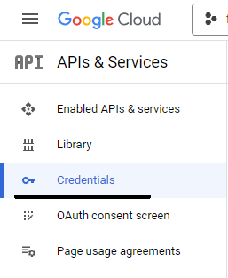
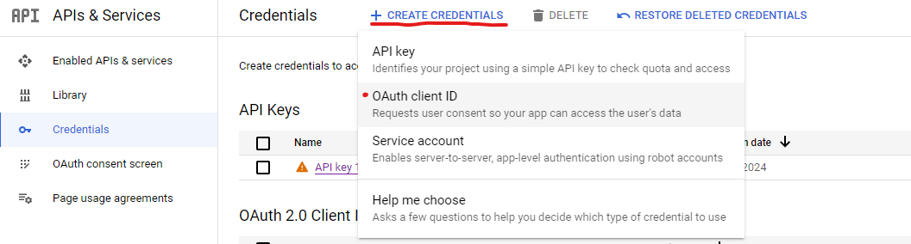
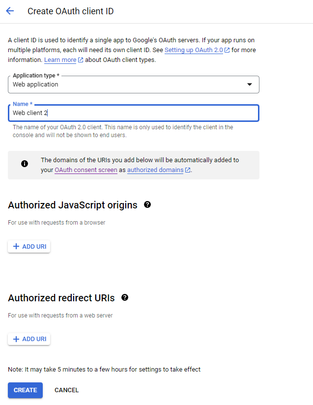
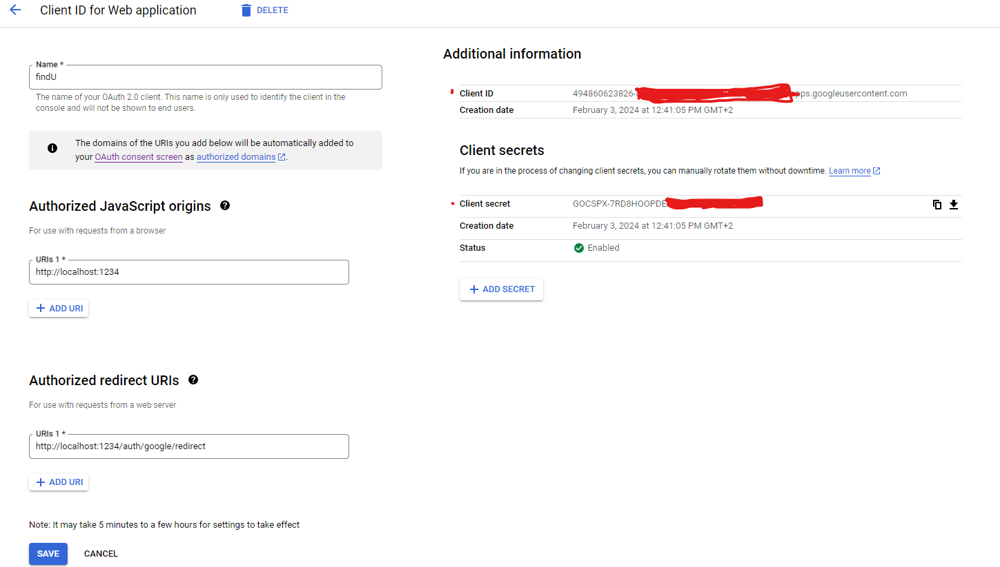

# Tinder clone

## Tech stack
* Redis: for session cookie
* MongoDB: storage of data
* React: frontend
* Node.js: Implementation of backend
* Express

## Steps
1. **Install the redis.** Proper guide is on this link: https://redis.io/docs/install/install-redis/install-redis-on-windows/ 

    Briefly, use these commands step by step through the WSL:

    ```
    curl -fsSL https://packages.redis.io/gpg | sudo gpg --dearmor -o /usr/share/keyrings/redis-archive-keyring.gpg

    echo "deb [signed-by=/usr/share/keyrings/redis-archive-keyring.gpg] https://packages.redis.io/deb $(lsb_release -cs) main" | sudo tee /etc/apt/sources.list.d/redis.list

    sudo apt-get update
    sudo apt-get install redis
    ```

    Before the start backend and frontend the command have to be run:

    ``` console 
    sudo service redis-server start
    ```
2. **Install MongoDB**
    Via this link download the MongoDB Community Server and install it: https://www.mongodb.com/try/download/community

3. **Install Node.js**

    Guide for installtion is here: https://learn.microsoft.com/en-us/windows/dev-environment/javascript/nodejs-on-windows#install-nvm-windows-nodejs-and-npm
    
    Download (from here: https://github.com/coreybutler/nvm-windows/releases) the nvm-setup.zip file for the most recent release.

    Once downloaded, open the zip file, then open the nvm-setup.exe file.

    The Setup-NVM-for-Windows installation wizard will walk you through the setup steps, including choosing the directory where both nvm-windows and Node.js will be installed.

4. **Keys**
    
    Open file in path server/routes/keys.js and write there your id and secret from google API.

    Go to google API and go to credentinals page

    

    Press on create button and OAuth client ID

    

    Fill the information

    

    Copy and paste the id and secret from this fields

    

5. **Install dependencies**
    
    For installation dependencies for client side:

    ```
    C:\Users\...\findu-app> npm run install
    ```

    For installation dependencies for client side:

    ```
    C:\Users\...\findu-app> npm run preinstall
    ```
6. **Run**

    You have to use two command lines. In the first run this command to run the server side.

    ```
    C:\Users\...\findu-app>set "NODE_ENV=development" && npm run dev:server
    ```

    In the second run this command to run the client side.

    ```
    C:\Users\...\findu-app> npm run dev:client
    ```
## User manual

The app have several pages:

* Autherization/register page
* Page with cards to swipe
* List of chats
* Chat with user
* Page if user wants to go on Autherization/register page, when he is already authentificated 

On this
[video](./images/my_video.mp4) you can see the registration and authentification process


